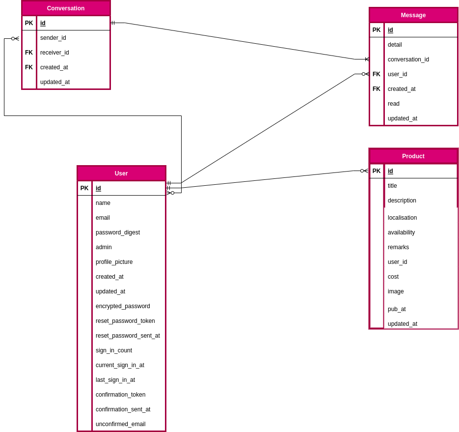
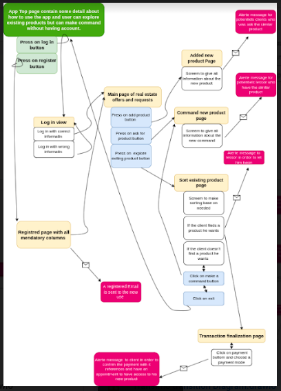
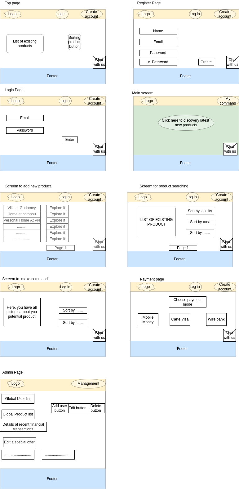

# README

## Version
Ruby 3.0.1  
Rails 6.0.4.8

## Employment Term technology
-devise  
-Message Function

## Technology Outside The Curiculum
-Cloudinary

## Execution Procedure
> $ git clone https://github.com/IBRAHIMA8/Transimo.git  
> $ cd Transimo  
> $ bundle install  
> $ rails db:create  
  $ rails db:migrate  
> $ rails s  
> $ rails s -b 0.0.0.0 (For Vagrant users)

## Checksheet
[Checksheet](https://docs.google.com/spreadsheets/d/1qmZAqBF2tuXCf04Z9btdsJBcBosX_RMnT6tko0v6LoA/edit?usp=sharing)

## Catalogue Design
[Catalogue Design](https://docs.google.com/spreadsheets/d/1DF_Ckj12vljzxptYd9rx6wh9R7rhRGhs1UXOHpzKtG0/edit?usp=sharing)

## Table Definition
[Table Definition](https://docs.google.com/spreadsheets/d/15RLani9iNNhnsPBu5qw8XenYsIGYRLzRQ1a5Ij6LsBQ/edit?usp=sharing)

## ER Diagram
[ER Diagram](https://drive.google.com/file/d/1R9jsH0x3CkbGAlppcnossTA82c5Ndd5O/view?usp=sharing) 

## Screen transition diagram
[screen transition](https://drive.google.com/file/d/1RSg5uVFGRnVSA97wXUH9u4e-rYHVYiQ1/view?usp=sharing) 

## Wireframe
[Wireframe](https://drive.google.com/file/d/1qvgIaae4-7T3Li_hBAJFpvnVwib2k91Q/view?usp=sharing) 

